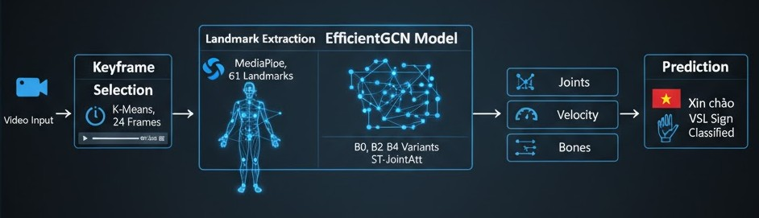

# Vietnamese Sign Language Recognition with EfficientGCN

Skeleton-based Vietnamese Sign Language Recognition (VSLR) using EfficientGCN. The end-to-end pipeline includes K-Means keyframe selection, 61-landmark extraction with MediaPipe, graph-centric cleaning and augmentation, training EfficientGCN family models (B0, B2, B4), and a simple web demo built with Streamlit + FastAPI.

<p align="center">
  <br>
  <em>Overview: Video -> 24 frames -> 61 landmarks -> 3 input branches -> EfficientGCN -> Prediction</em>
</p>

---

## Repository Structure

```text
.
├─ README.md
├─ requirements.txt
├─ start_inference.sh     # Demo script
├─ configs/
│  └─ 2002_100.yaml
├─ data/
│  └─ npy_splited/        # cleaned dataset
├─ src/
│  ├─ dataset/            # dataset wrappers, collate, graph utils
│  ├─ model/              # EfficientGCN + ST-JointAtt
│  ├─ train.py            # training loop
│  ├─ eval.py             # evaluation
│  └─ infer.py            # single-video inference
└─ app/
   ├─ main.py               # FastAPI (uvicorn)
   └─ ui.py              # Streamlit app
```

---

## Quickstart

### 1) Setup

```bash
# Python 3.10+ is recommended
pip install -r requirements.txt
```

### 2) Inference on a Single Video

```bash
python src/infer.py \
  --video path/to/video.mp4 \
  --checkpoint workdir/b0/checkpoint.pth \
  --out_json result.json
```

### 3) Web Demo

```bash
# Backend
uvicorn web.api.main:app --host 0.0.0.0 --port 8000

# Frontend
streamlit run web/app.py
```

---

## Citation

If you use EfficientGCN or this pipeline in your research, please cite:

```bibtex
@article{song2022constructing,
  author    = {Song, Yi-Fan and Zhang, Zhang and Shan, Caifeng and Wang, Liang},
  title     = {Constructing Stronger and Faster Baselines for Skeleton-based Action Recognition},
  journal   = {IEEE Transactions on Pattern Analysis and Machine Intelligence},
  year      = {2022},
  doi       = {10.1109/TPAMI.2022.3157033}
}
```

---

## License

MIT License. See `LICENSE` for details.

